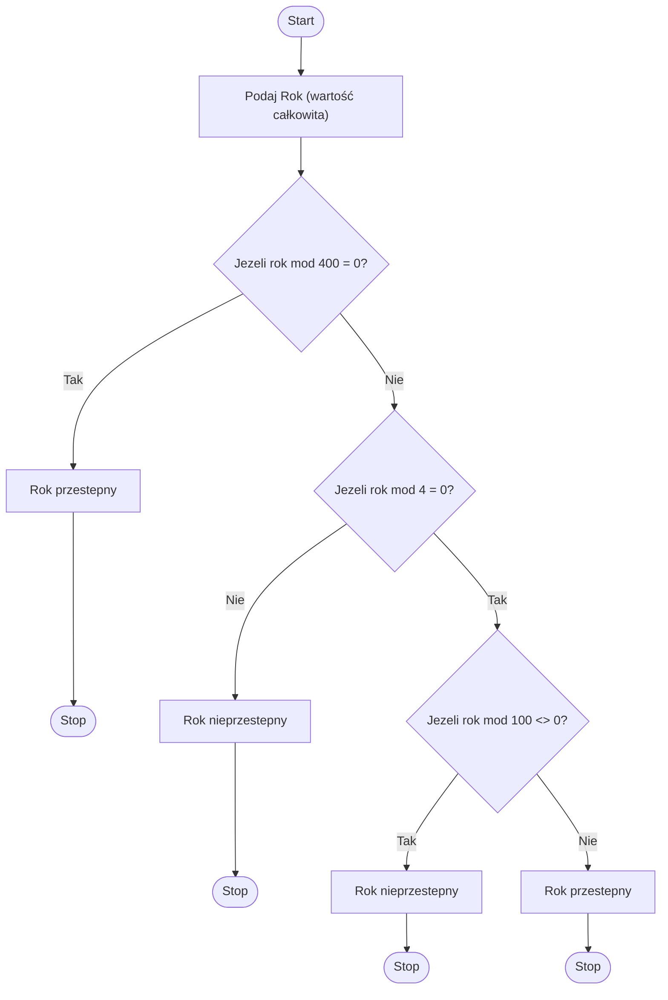

# Task 1: Solution

## Steps list

Polish:
1. Podaj Rok (wartość całkowita).
2. Jezeli rok mod 400 = 0 to pisz 'Rok przestepny'. Stop
3. Jezeli rok mod 4 = 0 to idz do krok 5.
4. Pisz 'Rok nieprzestępny'. Stop
5. Jezeli rok mod 100 <> 0 to pisz: 'Rok przstepny'. Stop
6. Pisz 'Rok nieprzestepny'.

## Diagram 

## Tests

Example test cases:
* Year = 2000 (divisible by 400, should be a leap year)
* Year = 1900 (divisible by 100 but not 400, should not be a leap year)
* Year = 2024 (divisible by 4 and not 100, should be a leap year)
* Year = 2023 (not divisible by 4, should not be a leap year)

The results of the test cases are as follows:
1.	Year = 2000
* Expected: "Rok przestepny"
* Result: "Rok przestepny" ✅

2.	Year = 1900
* Expected: "Rok nie przestepny"
* Result: "Rok nie przestepny" ✅

3.	Year = 2024
* Expected: "Rok przestepny"
* Result: "Rok przestepny" ✅

4.	Year = 2023
* Expected: "Rok nie przestepny"
* Result: "Rok nie przestepny" ✅