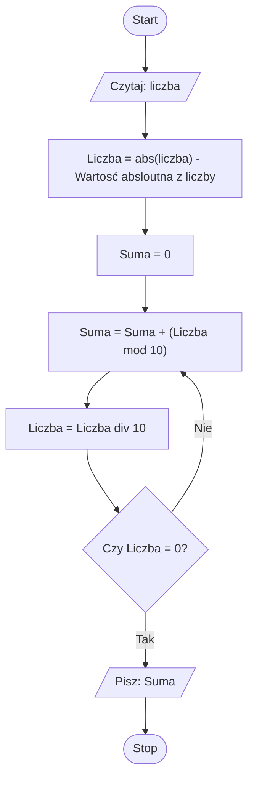

# Solution for Taks 2

## Algorithm math:

Integer: 258

// S = 0 // S - Suma, L - Liczba

258 mod 10 + 0 = 8  // S = L mod 10 + S

258 div 10 = 25     // L = L div 10

25 mod 10 + 8 = 5   // S = L mod 10 + S

25 div 10 = 25      // L = L div 10

2 mod 10 + 13 = 2   // S = L mod 10 + S

2 div 10 = 0        // L = L div 10

## Flowchart diagram

## Tests

Example test cases:
* Integer: 0
* Integer: 2
* Integer: 2137
* Integer: -6

The results of the test cases are as follows:

1. Integer: 0
* Suma = 0  ✅

2. Integer: 2
* Suma = 2 ✅

3. Integer: 2137
* Suma = 13 ✅

4. Integer: -6
* Suma: 6 wartość absolutna ✅