# Task 3: Solution

## Diagram

```mermaid
flowchart TD
    Start([Start]) 
    Start --> Init1["Ustaw: suma energii czynnej w taryfie I = 0"]
    Init1 --> Init2["Ustaw: suma energii czynnej w taryfie II = 0"]
    Init2 --> Init3["Ustaw: suma energii biernej w taryfie I = 0"]
    Init3 --> Init4["Ustaw: suma energii biernej w taryfie II = 0"]
    Init4 --> Init5["Ustaw: maksymala moc czynna w danym miesiacu kalendarzowym = 0"]
    Init5 --> Init6["Ustaw: data ostatniego zapisu maksymalnej mocy = biezaca data"]
    Init6 --> Init7["Ustaw: maksymala moc czynna w zeszylm miesiacu kalendarzowym = 0"]
    Init7 --> Init8["Ustaw: data właczenia licznika"]
    Init8 --> Loop["Pobranie danych: 1 sekunda"]

    Loop --> Load1["Wczytaj: Moc czynna"]
    Load1 --> Load2["Wczytaj: Moc bierna"]
    Load2 --> Load3["Wczytaj: Biezaca data"]
    Load3 --> Load4["Wczytaj: Biezaca godzina"]

    Load4 --> exitCheck{"Czy licznik działa 365 dni? Porownaj dzien startu z biezaca data"}
    exitCheck -- tak --> Stop(["Stop"])
    exitCheck -- nie --> TimeCheck{"Czy aktualny czas jest w Taryfie I (6:00-13:00 lub 15:00-22:00)?"}
    TimeCheck -- Tak --> TariffIActive["Ustaw: suma energii czynnej w taryfie I + moc czynna"]
    TariffIActive --> TariffIReactive["Ustaw: suma energii biernej w taryfie I + moc bierna"]
    TimeCheck -- Nie --> TariffIIActive["Ustaw: suma energii czynnej w taryfie II + moc czynna"]
    TariffIIActive --> TariffIIReactive["Ustaw: suma energii biernej w taryfie II + moc bierna"]
    
    TariffIReactive --> shouldSaveOldMonthMax{"Czy biezacy miesiac != miesiac ostatniego zapisu mocy maksymalnej<br>lub maksymalna moc w zeszlym miesiacu == 0?"}
    TariffIIReactive --> shouldSaveOldMonthMax

    shouldSaveOldMonthMax -- Tak --> UpdateLastMonthMax["Ustaw: maksymalna moc czynna w zeszlym miesiacu kalendarzowym = maksymalna moc w danym miesiacu kalendarzowym"]
    shouldSaveOldMonthMax -- Nie --> MaxCheck{"Czy maksymalna moc czynna < moc czynna<br>lub czy biezacy miesiac != miesiac ostatniego zapisu maksymalnej mocy?"}
    UpdateLastMonthMax --> MaxCheck

    MaxCheck -- Tak --> UpdateMax["Ustaw: maksymala moc czynna w danym miesiacu kalendarzowym = moc czynna"]
    UpdateMax --> UpdateMaxDate["Ustaw: data ostatniego zapisu maksymalnej mocy na biezaca date"] 
    MaxCheck -- Nie --> summaryTarrrifActiveI[Wypisz: Sumaryczne zużycie energii czynnej w taryfie I]
    UpdateMaxDate --> summaryTarrrifActiveI
    summaryTarrrifActiveI --> summaryTarrrifReactiveI[Wypisz: Sumaryczne zużycie energii biernej w taryfie I]
    summaryTarrrifReactiveI --> summaryTarrrifActiveII[Wypisz: Sumaryczne zużycie energii czynnej w taryfie II]
    summaryTarrrifActiveII --> summaryTarrrifReactiveII[Wypisz: Sumaryczne zużycie energii biernej w taryfie II]
    summaryTarrrifReactiveII --> lastMonthMaxActive[Wypisz: Maksymalną moc czynną pobraną w minionym miesiącu]

    lastMonthMaxActive --> Loop
```


## Tests

### 1. Analiza problemu

Algorytm odpowiada za monitorowanie i zapisywanie danych o zużyciu energii elektrycznej w dwóch taryfach (Taryfa I i Taryfa II). Podczas działania algorytm:
	1.	Rejestruje energię czynną i bierną dla obu taryf (Taryfa I i Taryfa II).
	2.	Oblicza sumaryczne zużycie energii (czynnej i biernej) w danej taryfie.
	3.	Monitoruje maksymalną moc czynną w bieżącym miesiącu i zapisuje dane o tej mocy.
	4.	Przechowuje informacje o maksymalnej mocy czynnej z poprzedniego miesiąca.
	5.	Kończy działanie, jeśli licznik działał przez 365 dni.

### 2. Scenariusze i przykładowe wartości

#### Test 1: Działanie dla jednego dnia
##### Wejście:
```json
{
    "Data_wlaczenia_licznika": "1 stycznia 2024 00:00:00",
    "dane": [
        {
            "Moc_czynna": 50,
            "Moc_bierna": 20,
            "Biezaca_data": "1 stycznia 2024",
            "Bierzaca_godzina": "13:00:00"
        },
         {
            "Moc_czynna": 30,
            "Moc_bierna": 10,
            "Biezaca_data": "1 stycznia 2024",
            "Bierzaca_godzina": "13:00:01"
        },
        {
            "Moc_czynna": 45,
            "Moc_bierna": 13,
            "Biezaca_data": "1 stycznia 2024",
            "Bierzaca_godzina": "13:00:02"
        }
    ]
}
```

##### Przebieg algorytmu

1. **Inicjalizacja:**
- Suma energii czynnej w taryfie I: 0
- Suma energii czynnej w taryfie II: 0
- Suma energii biernej w taryfie I: 0
- Suma energii biernej w taryfie II: 0
- Maksymalna moc czynna w danym miesiącu kalendarzowym: 0
- Data ostatniego zapisu maksymalnej mocy: 1 stycznia 2024
- Maksymalna moc czynna w zeszłym miesiącu: 0
- Data włączenia licznika: 1 stycznia 2024

2. **Przetwarzanie danych:**

**Pierwszy zestaw danych:**
- Moc czynna = 50 W
- Moc bierna = 20 W
- Biezaca godzina = 13:00:00 (czyli czas w taryfie I)

Zgodnie z algorytmem:
- Suma energii czynnej w taryfie I = 50 W
- Suma energii biernej w taryfie I = 20 W
- Maksymalna moc czynna = 50 W (ponieważ 50 > 0, zaktualizowano maksymalną moc)

**Drugi zestaw danych:**
- Moc czynna = 30 W
- Moc bierna = 10 W
- Biezaca godzina = 13:00:01 (również w taryfie I)

Zgodnie z algorytmem:
- Suma energii czynnej w taryfie I = 50 W + 30 W = 80 W
- Suma energii biernej w taryfie I = 20 W + 10 W = 30 W
- Maksymalna moc czynna pozostaje 50 W, ponieważ 50 W > 30 W.

**Trzeci zestaw danych:**
- Moc czynna = 45 W
- Moc bierna = 13 W
- Biezaca godzina = 13:00:02 (wciąż w taryfie I)

Zgodnie z algorytmem:
- Suma energii czynnej w taryfie I = 80 W + 45 W = 125 W
- Suma energii biernej w taryfie I = 30 W + 13 W = 43 W
- Maksymalna moc czynna pozostaje 50 W, ponieważ 50 W > 45 W.

3. **Podsumowanie dla dnia 1 stycznia 2024:**
- Sumaryczne zużycie energii czynnej w taryfie I: 125 W
- Sumaryczne zużycie energii biernej w taryfie I: 43 W
- Sumaryczne zużycie energii czynnej w taryfie II: 0 W (brak danych w taryfie II)
- Sumaryczne zużycie energii biernej w taryfie II: 0 W (brak danych w taryfie II)
- Maksymalna moc czynna w minionym miesiącu: 50 W
- Data ostatniego zapisu maksymalnej mocy: 1 stycznia 2024

##### Wyniki:
- Suma energii czynnej w taryfie I = 125 W
- Suma energii biernej w taryfie I = 43 W
- Suma energii czynnej w taryfie II = 0 W
- Suma energii biernej w taryfie II = 0 W
- Maksymalna moc czynna w danym miesiącu = 50 W
- Data ostatniego zapisu maksymalnej mocy = 1 stycznia 2024

---


#### Test 2: Zakończenie działania po 365 dniach
##### Wejście:
```json
{
    "Data_wlaczenia_licznika": "1 stycznia 2024 00:00:00",
    "dane": [
        {
            "Moc_czynna": 50,
            "Moc_bierna": 20,
            "Biezaca_data": "31 grudnia 2024",
            "Bierzaca_godzina": "23:59:59"
        },
         {
            "Moc_czynna": 10,
            "Moc_bierna": 5,
            "Biezaca_data": "1 stycznia 2025",
            "Bierzaca_godzina": "00:00:00"
        },
        {
            "Moc_czynna": 20,
            "Moc_bierna": 1,
            "Biezaca_data": "1 stycznia 2025",
            "Bierzaca_godzina": "00:00:01"
        }
    ]
}
```
##### Przebieg algorytmu:

1. **Inicjalizacja:**
   - Suma energii czynnej w taryfie I: 0
   - Suma energii czynnej w taryfie II: 0
   - Suma energii biernej w taryfie I: 0
   - Suma energii biernej w taryfie II: 0
   - Maksymalna moc czynna w danym miesiącu kalendarzowym: 0
   - Data ostatniego zapisu maksymalnej mocy: 1 stycznia 2024
   - Maksymalna moc czynna w zeszłym miesiącu: 0
   - Data włączenia licznika: 1 stycznia 2024

2. **Przetwarzanie danych:**
   - **Pierwszy zestaw danych (31 grudnia 2024, 23:59:59):**
     - Moc czynna = 50 W
     - Moc bierna = 20 W
     - Bieżaca godzina = 23:59:59 (czyli czas przed końcem 365 dni)
     - Zgodnie z algorytmem:
       - Suma energii czynnej w taryfie I = 50 W
       - Suma energii biernej w taryfie I = 20 W
       - Maksymalna moc czynna = 50 W (ponieważ 50 > 0, zaktualizowano maksymalną moc)
   - **Drugi zestaw danych (1 stycznia 2025, 00:00:00):**
     - Moc czynna = 10 W
     - Moc bierna = 5 W
     - Bieżaca godzina = 00:00:00 (czas po zakończeniu 365 dni)
     - Zgodnie z algorytmem:
       - Program sprawdza, czy licznik działa przez 365 dni.
       - Licznik działa przez pełne 365 dni, więc algorytm zatrzymuje się.
       - Zatrzymanie działania liczników skutkuje końcem obliczeń.

3. **Zakończenie działania:**
   - Po 365 dniach działanie licznika jest zakończone. Program przestaje przetwarzać dane.
   - Ostateczny stan licznika jest zapisany, a przetwarzanie danych nie jest kontynuowane.

##### Wyniki:
   - Suma energii czynnej w taryfie I = 50 W
   - Suma energii biernej w taryfie I = 20 W
   - Suma energii czynnej w taryfie II = 0 W
   - Suma energii biernej w taryfie II = 0 W
   - Maksymalna moc czynna w danym miesiącu = 50 W
   - Data ostatniego zapisu maksymalnej mocy = 31 grudnia 2024

---