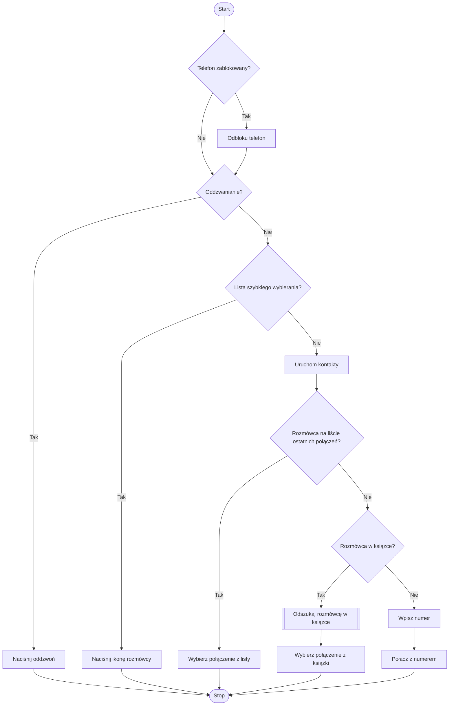

# Task 4: Solution

### Diagram

### Opis algorytmu językiem naturalnym:
Algorytm przedstawia proces wykonywania połączenia telefonicznego na urządzeniu, którego ekran jest zablokowany lub odblokowany. Na początku sprawdzamy, czy telefon jest zablokowany. Jeśli tak, telefon zostaje odblokowany, a następnie przechodzimy do pytania, czy użytkownik chce oddzwonić. Jeśli odpowiedź jest “tak”, telefon automatycznie przechodzi do funkcji “oddzwoń”. Jeśli odpowiedź jest “nie”, sprawdzamy, czy użytkownik ma włączoną listę szybkiego wybierania. Jeśli tak, należy nacisnąć ikonę rozmówcy na tej liście, co kończy proces. Jeśli lista szybkiego wybierania nie jest dostępna, uruchamiamy kontakty w telefonie.

W kolejnym kroku sprawdzamy, czy rozmówca jest na liście ostatnich połączeń. Jeśli tak, użytkownik wybiera połączenie z tej listy i proces zostaje zakończony. Jeśli rozmówca nie znajduje się na liście ostatnich połączeń, sprawdzamy, czy jest zapisany w książce kontaktów. Jeśli jest, użytkownik wyszukuje rozmówcę w książce kontaktów, a następnie wybiera odpowiedni kontakt. W przeciwnym razie użytkownik musi wpisać numer telefonu ręcznie i dzwonić na niego, po czym algorytm kończy proces.

### Lista kroków:

1. **Start** - Rozpoczęcie algorytmu.
2. **Sprawdzenie, czy telefon jest zablokowany**:
   - Jeśli tak, odblokuj telefon.
   - Jeśli nie, przejdź do kroku 3.
3. **Sprawdzenie, czy użytkownik chce oddzwonić**:
   - Jeśli tak, przejdź do kroku 4 (naciśnij “oddzwoń”).
   - Jeśli nie, przejdź do kroku 5.
4. **Oddzwanianie** - Użytkownik naciska przycisk “oddzwoń” i proces kończy się.
5. **Sprawdzenie, czy użytkownik ma listę szybkiego wybierania**:
   - Jeśli tak, przejdź do kroku 6 (naciśnij ikonę rozmówcy).
   - Jeśli nie, przejdź do kroku 7.
6. **Naciśnij ikonę rozmówcy z listy szybkiego wybierania** - Proces kończy się.
7. **Uruchomienie książki kontaktów**.
8. **Sprawdzenie, czy rozmówca znajduje się na liście ostatnich połączeń**:
   - Jeśli tak, przejdź do kroku 9 (wybierz rozmówcę z listy).
   - Jeśli nie, przejdź do kroku 10.
9. **Wybór rozmówcy z listy ostatnich połączeń** - Proces kończy się.
10. **Sprawdzenie, czy rozmówca jest zapisany w książce kontaktów**:
    - Jeśli tak, przejdź do kroku 11 (wyszukiwanie rozmówcy).
    - Jeśli nie, przejdź do kroku 12.
11. **Wyszukiwanie rozmówcy w książce kontaktów** - Po znalezieniu rozmówcy, przejdź do kroku 13 (wybór kontaktu).
12. **Ręczne wpisanie numeru telefonu**.
13. **Połączenie z numerem telefonu** - Proces kończy się.

**Stop** - Koniec algorytmu.

