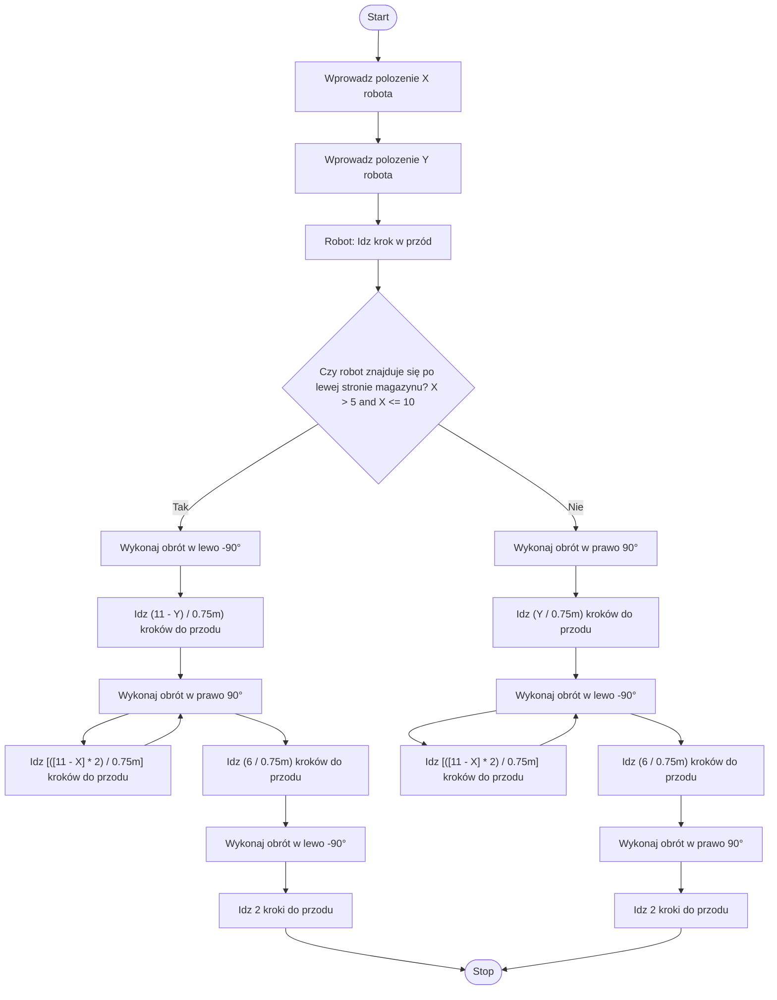

# Task 5: Solution

## Diagram

## Opisz algorytm językiem naturalnym

1. Na początku należy wprowadzić aktualne położenie robota poprzez podanie jego współrzędnych X i Y.

2. Robot wykonuje jeden krok do przodu, aby wyjść z miejsca parkingowego.

3. Następnie algorytm sprawdza, czy robot znajduje się po lewej stronie magazynu.

4. Jeśli robot znajduje się po lewej stronie magazynu:
   - Robot wykonuje obrót w lewo o -90 stopni
   - Przemieszcza się do przodu o liczbę kroków równą [(11 - Y) / 0.75m]
   - Wykonuje obrót w prawo o 90 stopni
   - Idzie do przodu o liczbę kroków wyliczoną ze wzoru [([11 - X] * 2) / 0.75m]
   - Wykonuje obrót w prawo o 90 stopni
   - Przemieszcza się do przodu o liczbę kroków równą (6 / 0.75m)
   - Wykonuje obrót w lewo o -90 stopni, aby ustawić się w kierunku wyjścia
   - Na końcu idzie 2 kroki i wychodzi z magazynu

5. Jeśli robot znajduje się po prawej stronie magazynu:
   - Robot wykonuje obrót w prawo o 90 stopni
   - Przemieszcza się do przodu o liczbę kroków równą (Y / 0.75m)
   - Wykonuje obrót w lewo o -90 stopni
   - Idzie do przodu o liczbę kroków wyliczoną ze wzoru [([11 - X] * 2) / 0.75m]
   - Wykonuje obrót w lewo o -90 stopni
   - Przemieszcza się do przodu o liczbę kroków równą (6 / 0.75m)
   - Wykonuje obrót w prawo o 90 stopni, aby ustawić się w kierunku wyjścia
   - Na końcu idzie 2 kroki i wychodzi z magazynu

Wszystkie ruchy są precyzyjnie wyliczane z uwzględnieniem długości kroku robota wynoszącej 0.75 metra. Algorytm zapewnia, że robot dotrze do wyjścia najkrótszą możliwą drogą, unikając kolizji z innymi zajętymi miejscami.

## Kroki Algorytmu

1. **Faza wprowadzania danych**
   1. Wprowadź położenie X robota
   2. Wprowadź położenie Y robota

2. **Ruch początkowy**
   1. Przesuń robota jeden krok do przodu, aby opuścić miejsce

3. **Sprawdzenie pozycji**
   1. Sprawdź, czy robot znajduje się po lewej stronie magazynu

4. **Ścieżka dla lewej strony** (jeśli robot jest po lewej stronie)
   1. Wykonaj obrót w lewo (-90°)
   2. Idź do przodu [(11 - Y) / 0.75m] kroków
   3. Wykonaj obrót w prawo (90°)
   4. Idź do przodu [([11 - X] * 2) / 0.75m] kroków
   5. Wykonaj obrót w prawo (90°)
   6. Idź do przodu (6 / 0.75m) kroków
   7. Wykonaj obrót w lewo (-90°)
   8. Idz 2 kroki do przodu
   9. Zatrzymaj się

5. **Ścieżka dla prawej strony** (jeśli robot jest po prawej stronie)
   1. Wykonaj obrót w prawo (90°)
   2. Idź do przodu (Y / 0.75m) kroków
   3. Wykonaj obrót w lewo (-90°)
   4. Idź do przodu [([11 - X] * 2) / 0.75m] kroków
   5. Wykonaj obrót w lewo (-90°)
   6. Idź do przodu (6 / 0.75m) kroków
   7. Wykonaj obrót w prawo (90°)
   8. Idz 2 kroki do przodu
   9. Zatrzymaj się

Uwaga: Wszystkie ruchy są obliczane na podstawie długości kroku robota wynoszącej 0.75 metra.

## Test poprawności algorytmu
 
### Scenariusze i przykładowe wartości

#### Scenariusz 1: Robot zaczyna na pozycji (2, 3)

1. Start w pozyji x=2, y=3
2. Robot idzie krok do przodu
3. Robot znajduje się po prawej stronie magazynu
4. Robot wykonuje obrót w prawo o 90°
5. Robot idzie 4 kroki do przodu
6. Robot wykonuje obrót w lewo o 90°
7. Robot idzie 12 kroków do przodu.
8. Robot wykonuje obrót w lewo o 90°
9. Robot idzie 8 kroków do przodu.
10. Robot wykonuje obrót w prawo o 90°
11. Robot idzie 2 kroki do przodu
12. Robot opuszcza magazyn

#### Scenariusz 2: Robot zaczyna na pozycji (8, 7)
1. Start w pozyji x=8, y=7
2. Robot idzie krok do przodu
3. Robot znajduje się po lewej stronie magazynu
4. Robot wykonuje obrót w lewo o 90°
5. Robot idzie 5.33 kroki do przodu
6. Robot wykonuje obrót w prawo o 90°
7. Robot idzie 8 kroków do przodu.
8. Robot wykonuje obrót w prawo o 90°
9. Robot idzie 8 kroków do przodu.
10. Robot wykonuje obrót w lewo o 90°
11. Robot idzie 2 kroki do przodu
12. Robot opuszcza magazyn

