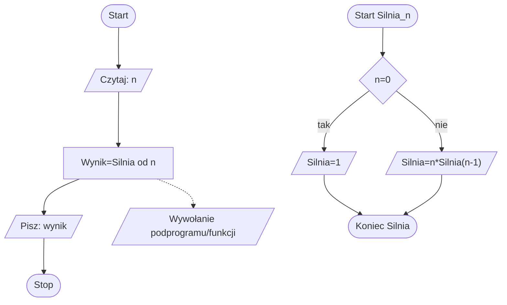
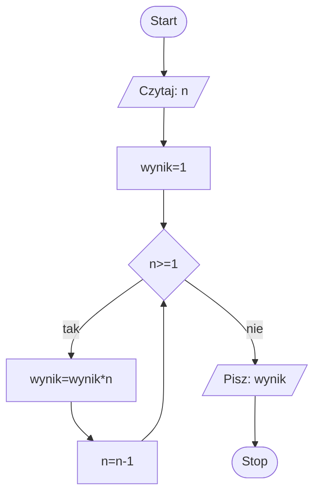

# Zadanie 1: Obliczanie silni

## Diagramy:





## Linki do plików z rozwiązaniami
* [Pascal](./Pascal/silnia.pas)
* [Python](./Python/silnia.py)

## Test poprawności programu
Program oblicza silnię dwoma metodami: rekurencyjną i iteracyjną, z wykorzystaniem typu Int64 dla dużych liczb.
 
### Scenariusze i przykładowe wartości

#### Scenariusz 1: Podstawowe obliczenie silni
Testowanie standardowego obliczenia silni dla małych liczb

##### Dane wejściowe:
```pascal
5
```

###### Oczekiwane wyniki:
**120**

###### Rezultat:
Pascal:
```text
Podaj nieujemną liczbę do obliczenia silni: 5
Silnia iteracyjnie:   120
Silnia rekurencyjnie: 120
```

#### Scenariusz 2: Silnia zero
Testowanie przypadku brzegowego 0!

##### Dane wejściowe:
```pascal
0
```

###### Oczekiwane wyniki:
**1**

###### Rezultat:
Pascal:
```text
Podaj nieujemną liczbę do obliczenia silni: 0
Silnia iteracyjnie:   1
Silnia rekurencyjnie: 1
```

#### Scenariusz 3: Duża liczba
Testowanie obliczenia silni dla większej liczby w zakresie Int64

##### Dane wejściowe:
```pascal
20
```

###### Oczekiwane wyniki:
**2432902008176640000**

###### Rezultat:
Pascal:
```text
Podaj nieujemną liczbę do obliczenia silni: 20
Silnia iteracyjnie:   2432902008176640000
Silnia rekurencyjnie: 2432902008176640000
```

#### Scenariusz 4: Obsługa błędnych danych
Testowanie reakcji programu na nieprawidłowe dane wejściowe

##### Dane wejściowe:
```pascal
-5
```

###### Oczekiwane wyniki:
**Komunikat błędu i prośba o ponowne wprowadzenie danych**

###### Rezultat:
Pascal:
```text
Podaj nieujemną liczbę do obliczenia silni: -5
Proszę podać prawidłową liczbę nieujemną!
Podaj nieujemną liczbę do obliczenia silni:
```