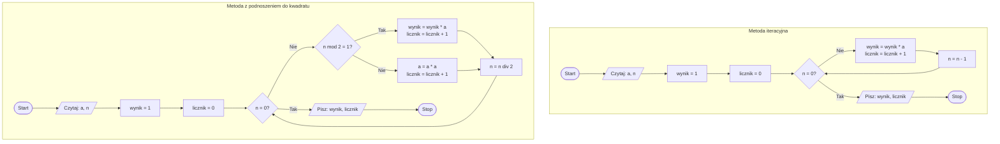

## Diagram


## Omówienie wyników

> Zadanie: Potwierdź, podając przykłady, w jakim stopniu użycie podnoszenia liczby do kwadratu ograniczyło liczbę mnożeń w procedurze.

```text
Dla n = 8:
```

Metody klasyczne (iteracyjna i rekurencyjna): 8 mnożeń
Metoda kwadratowa iteracyjna: 5 mnożeń
Metoda kwadratowa rekurencyjna: 4 mnożenia
Redukcja: z 8 do 4 mnożeń (50% redukcja)

```text
Dla n = 15:
```

Metody klasyczne: 15 mnożeń
Metoda kwadratowa iteracyjna: 8 mnożeń
Metoda kwadratowa rekurencyjna: 7 mnożeń
Redukcja: z 15 do 7 mnożeń (53% redukcja)