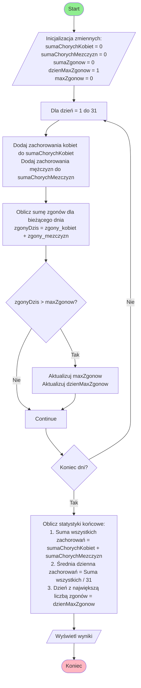

# Diagram


# Alternatywne struktury danych dla statystyk COVID-19

## 1. Struktura z pojedynczym rekordem dla dnia

Zamiast używać tablicy dwuwymiarowej, możemy stworzyć jeden rekord zawierający wszystkie dane dla danego dnia:

```pascal
type
  TDayRecord = record
    day: Integer;
    femaleData: record
      cases: Integer;
      deaths: Integer;
    end;
    maleData: record
      cases: Integer;
      deaths: Integer;
    end;
  end;
  
  TCovidData = array[1..31] of TDayRecord;
```

Zalety:
- Bardziej intuicyjna organizacja danych
- Łatwiejszy dostęp do wszystkich danych dla konkretnego dnia
- Mniejsze ryzyko pomyłek przy indeksowaniu

## 2. Struktura z osobnymi tablicami dla każdego typu danych

Możemy rozdzielić dane na osobne tablice dla każdego typu informacji:

```pascal
type
  TCovidStats = record
    femaleCases: array[1..31] of Integer;
    maleCases: array[1..31] of Integer;
    femaleDeaths: array[1..31] of Integer;
    maleDeaths: array[1..31] of Integer;
  end;
```

Zalety:
- Łatwiejsze operacje na konkretnym typie danych
- Prostsze obliczanie sum i średnich
- Uproszczone kopiowanie i przenoszenie konkretnych zestawów danych

## 3. Struktura wykorzystująca typ wyliczeniowy dla dni

Możemy użyć typu wyliczeniowego dla dni miesiąca:

```pascal
type
  TMonthDay = (Day1, Day2, Day3, ..., Day31);
  
  TDailyData = record
    cases: Integer;
    deaths: Integer;
  end;
  
  TCovidData = array[TMonthDay, TGender] of TDailyData;
```

Zalety:
- Większe bezpieczeństwo typów
- Łatwiejsze debugowanie
- Lepsza czytelność kodu

## 4. Struktura z listą jednokierunkową

Dla bardziej elastycznego rozwiązania możemy użyć listy:

```pascal
type
  TDayNode = ^TDayRecord;
  TDayRecord = record
    day: Integer;
    femaleData: TDailyData;
    maleData: TDailyData;
    next: TDayNode;
  end;
```

Zalety:
- Dynamiczne dodawanie nowych dni
- Łatwe sortowanie i filtrowanie danych
- Możliwość rozszerzenia o dodatkowe informacje

## 5. Struktura z tablicą dynamiczną

Jeśli liczba dni może się zmieniać:

```pascal
type
  TDynamicCovidData = record
    data: array of record
      day: Integer;
      femaleData: TDailyData;
      maleData: TDailyData;
    end;
    count: Integer;
  end;
```

Zalety:
- Elastyczna liczba dni
- Oszczędność pamięci
- Łatwe dodawanie i usuwanie rekordów

## 6. Struktura wykorzystująca słownik

Implementacja z wykorzystaniem tablicy asocjacyjnej:

```pascal
type
  THashTable = array[1..31] of record
    isOccupied: Boolean;
    data: record
      femaleData: TDailyData;
      maleData: TDailyData;
    end;
  end;
```

Zalety:
- Szybki dostęp do danych
- Możliwość przechowywania niekompletnych danych
- Efektywne wyszukiwanie

## Podsumowanie

Wybór struktury danych zależy od konkretnych wymagań:

1. Dla stałej liczby dni (31) i prostoty implementacji - obecne rozwiązanie jest odpowiednie
2. Dla większej elastyczności - struktura z listą lub tablicą dynamiczną
3. Dla lepszej organizacji danych - struktura z pojedynczym rekordem dla dnia
4. Dla optymalizacji konkretnych operacji - struktura z osobnymi tablicami

Każda z proponowanych alternatyw ma swoje zalety i wady, a wybór powinien być podyktowany:
- Wymaganiami wydajnościowymi
- Częstotliwością poszczególnych operacji
- Potrzebami w zakresie modyfikacji danych
- Ograniczeniami pamięciowymi
- Wymaganiami dotyczącymi czytelności kodu