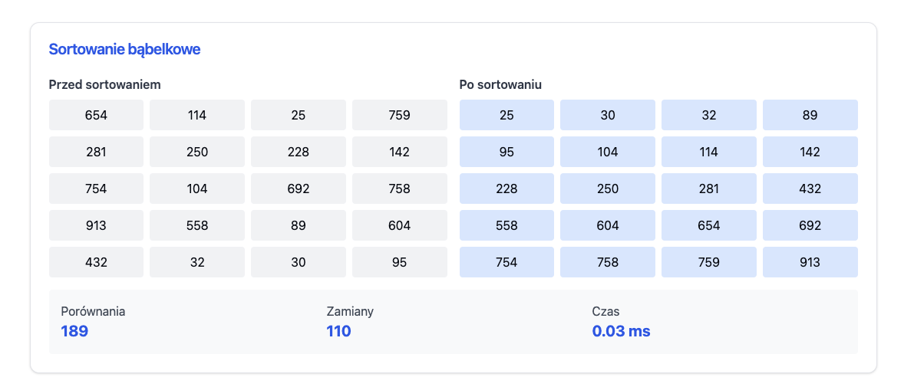
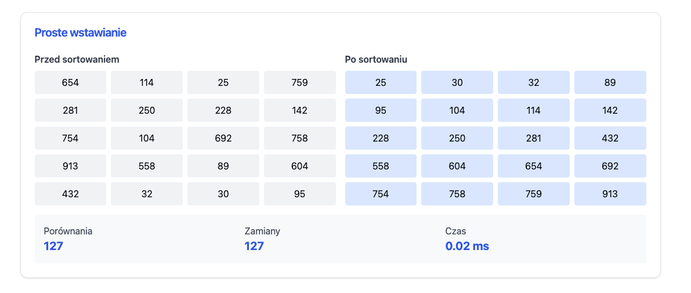
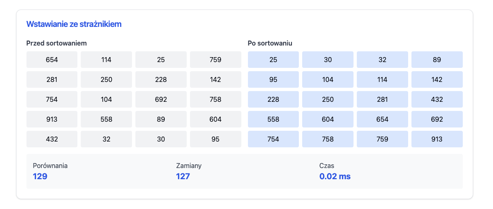
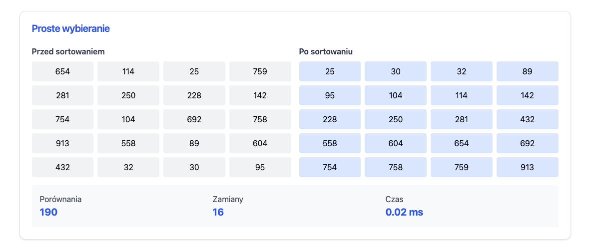
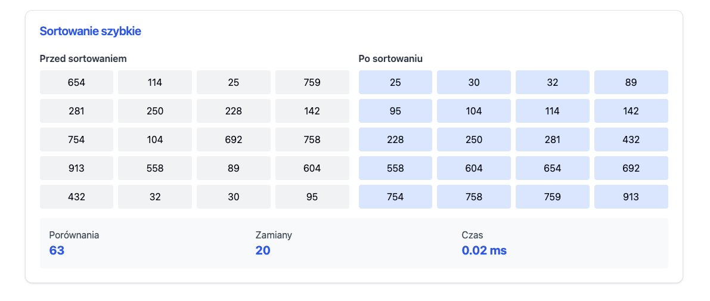

Here's the complete Markdown formatting in a more visually appealing way using natural spacing and headers. You can directly copy and paste this into your .md file:

# 📊 Analiza Algorytmów Sortowania

---

## 🔄 Sortowanie Bąbelkowe

### Dane sortowania
| Indeks | Przed | Po |
|:------:|:-----:|:--:|
| 1 | 654 | 25 |
| 2 | 114 | 30 |
| 3 | 25 | 32 |
| 4 | 759 | 89 |
| 5 | 281 | 95 |
| 6 | 250 | 104 |
| 7 | 228 | 114 |
| 8 | 142 | 142 |
| 9 | 754 | 228 |
| 10 | 104 | 250 |
| 11 | 692 | 281 |
| 12 | 758 | 432 |
| 13 | 913 | 558 |
| 14 | 558 | 604 |
| 15 | 89 | 654 |
| 16 | 604 | 692 |
| 17 | 432 | 754 |
| 18 | 32 | 758 |
| 19 | 30 | 759 |
| 20 | 95 | 913 |

### Statystyki
| Metryka | Wartość |
|:--------|:-------:|
| Porównania | 189 |
| Zamiany | 110 |
| Czas | 0.03 ms |

---

## ⬆️ Proste Wstawianie

### Dane sortowania
| Indeks | Przed | Po |
|:------:|:-----:|:--:|
| 1 | 654 | 25 |
| 2 | 114 | 30 |
| 3 | 25 | 32 |
| 4 | 759 | 89 |
| 5 | 281 | 95 |
| 6 | 250 | 104 |
| 7 | 228 | 114 |
| 8 | 142 | 142 |
| 9 | 754 | 228 |
| 10 | 104 | 250 |
| 11 | 692 | 281 |
| 12 | 758 | 432 |
| 13 | 913 | 558 |
| 14 | 558 | 604 |
| 15 | 89 | 654 |
| 16 | 604 | 692 |
| 17 | 432 | 754 |
| 18 | 32 | 758 |
| 19 | 30 | 759 |
| 20 | 95 | 913 |

### Statystyki
| Metryka | Wartość |
|:--------|:-------:|
| Porównania | 127 |
| Zamiany | 127 |
| Czas | 0.02 ms |

---

## 🛡️ Wstawianie ze Strażnikiem

### Dane sortowania
| Indeks | Przed | Po |
|:------:|:-----:|:--:|
| 1 | 654 | 25 |
| 2 | 114 | 30 |
| 3 | 25 | 32 |
| 4 | 759 | 89 |
| 5 | 281 | 95 |
| 6 | 250 | 104 |
| 7 | 228 | 114 |
| 8 | 142 | 142 |
| 9 | 754 | 228 |
| 10 | 104 | 250 |
| 11 | 692 | 281 |
| 12 | 758 | 432 |
| 13 | 913 | 558 |
| 14 | 558 | 604 |
| 15 | 89 | 654 |
| 16 | 604 | 692 |
| 17 | 432 | 754 |
| 18 | 32 | 758 |
| 19 | 30 | 759 |
| 20 | 95 | 913 |

### Statystyki
| Metryka | Wartość |
|:--------|:-------:|
| Porównania | 129 |
| Zamiany | 127 |
| Czas | 0.02 ms |

---

## 🔍 Proste Wybieranie

### Dane sortowania
| Indeks | Przed | Po |
|:------:|:-----:|:--:|
| 1 | 654 | 25 |
| 2 | 114 | 30 |
| 3 | 25 | 32 |
| 4 | 759 | 89 |
| 5 | 281 | 95 |
| 6 | 250 | 104 |
| 7 | 228 | 114 |
| 8 | 142 | 142 |
| 9 | 754 | 228 |
| 10 | 104 | 250 |
| 11 | 692 | 281 |
| 12 | 758 | 432 |
| 13 | 913 | 558 |
| 14 | 558 | 604 |
| 15 | 89 | 654 |
| 16 | 604 | 692 |
| 17 | 432 | 754 |
| 18 | 32 | 758 |
| 19 | 30 | 759 |
| 20 | 95 | 913 |

### Statystyki
| Metryka | Wartość |
|:--------|:-------:|
| Porównania | 190 |
| Zamiany | 16 |
| Czas | 0.02 ms |

---

## ⚡ Sortowanie Szybkie

### Dane sortowania
| Indeks | Przed | Po |
|:------:|:-----:|:--:|
| 1 | 654 | 25 |
| 2 | 114 | 30 |
| 3 | 25 | 32 |
| 4 | 759 | 89 |
| 5 | 281 | 95 |
| 6 | 250 | 104 |
| 7 | 228 | 114 |
| 8 | 142 | 142 |
| 9 | 754 | 228 |
| 10 | 104 | 250 |
| 11 | 692 | 281 |
| 12 | 758 | 432 |
| 13 | 913 | 558 |
| 14 | 558 | 604 |
| 15 | 89 | 654 |
| 16 | 604 | 692 |
| 17 | 432 | 754 |
| 18 | 32 | 758 |
| 19 | 30 | 759 |
| 20 | 95 | 913 |

### Statystyki
| Metryka | Wartość |
|:--------|:-------:|
| Porównania | 63 |
| Zamiany | 20 |
| Czas | 0.02 ms |

---

## 📈 Podsumowanie Wydajności

| Algorytm | Porównania | Zamiany | Czas (ms) |
|:---------|:----------:|:-------:|:---------:|
| Sortowanie Bąbelkowe | 189 | 110 | 0.03 |
| Proste Wstawianie | 127 | 127 | 0.02 |
| Wstawianie ze Strażnikiem | 129 | 127 | 0.02 |
| Proste Wybieranie | 190 | 16 | 0.02 |
| Sortowanie Szybkie | 63 | 20 | 0.02 |