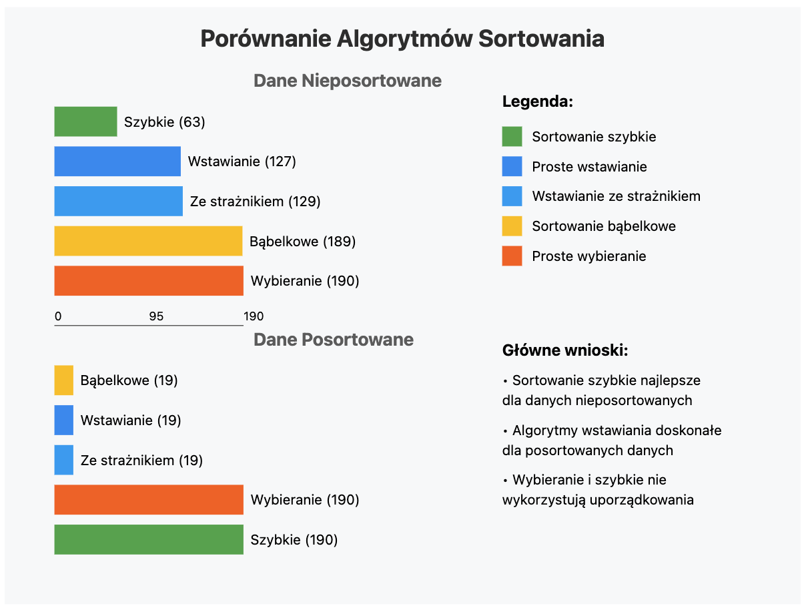

# 🎯 Analiza Algorytmów Sortowania

## 📊 Porównanie Wydajności


### Dane Nieuporządkowane

| Algorytm | 🔄 Porównania | 🔀 Zamiany | ⚡ Wydajność |
|:---------|:-------------:|:----------:|:-----------:|
| Sortowanie szybkie | 63 | 20 | 🌟🌟🌟🌟🌟 |
| Proste wstawianie | 127 | 127 | 🌟🌟🌟🌟 |
| Wstawianie ze strażnikiem | 129 | 127 | 🌟🌟🌟🌟 |
| Sortowanie bąbelkowe | 189 | 110 | 🌟🌟 |
| Proste wybieranie | 190 | 16 | 🌟🌟🌟 |

### Dane Posortowane

| Algorytm | 🔄 Porównania | 🔀 Zamiany | ⚡ Wydajność |
|:---------|:-------------:|:----------:|:-----------:|
| Sortowanie bąbelkowe | 19 | 0 | 🌟🌟🌟🌟🌟 |
| Proste wstawianie | 19 | 0 | 🌟🌟🌟🌟🌟 |
| Wstawianie ze strażnikiem | 19 | 0 | 🌟🌟🌟🌟🌟 |
| Proste wybieranie | 190 | 0 | 🌟🌟 |
| Sortowanie szybkie | 190 | 0 | 🌟🌟 |

## 🎯 Najlepsze Zastosowania

### 🚀 Sortowanie Szybkie (QuickSort)
```
Zalety:
✅ Najlepsza wydajność dla losowych danych
✅ Najmniej porównań dla nieuporządkowanych danych
✅ Dobra wydajność pamięciowa

Wady:
❌ Słabsza wydajność dla posortowanych danych
❌ Bardziej skomplikowana implementacja
```

### 📥 Proste Wstawianie
```
Zalety:
✅ Świetne dla małych zbiorów danych
✅ Doskonałe dla prawie posortowanych danych
✅ Prosta implementacja

Wady:
❌ Dużo zamian dla nieuporządkowanych danych
❌ Nieefektywne dla dużych zbiorów
```

### 🛡️ Wstawianie ze Strażnikiem
```
Zalety:
✅ Podobne do prostego wstawiania
✅ Mniej porównań w pętli wewnętrznej
✅ Dobre dla małych zbiorów

Wady:
❌ Wymaga dodatkowej pamięci
❌ Bardziej skomplikowana implementacja
```

### 🔄 Sortowanie Bąbelkowe
```
Zalety:
✅ Najprostsza implementacja
✅ Dobre dla prawie posortowanych danych
✅ Łatwe do zrozumienia

Wady:
❌ Dużo porównań i zamian
❌ Nieefektywne dla dużych zbiorów
```

### 🎯 Proste Wybieranie
```
Zalety:
✅ Najmniej zamian elementów
✅ Przewidywalna liczba operacji
✅ Stabilne działanie

Wady:
❌ Stała duża liczba porównań
❌ Nie adaptuje się do danych
```

## 📈 Rekomendacje Użycia

| Scenariusz | Rekomendowany Algorytm | Dlaczego? |
|:-----------|:----------------------:|:----------|
| 🔸 Małe zbiory danych (<50 elementów) | Proste wstawianie | Prosta implementacja, dobra wydajność |
| 🔸 Duże zbiory danych | Sortowanie szybkie | Najlepsza ogólna wydajność |
| 🔸 Prawie posortowane dane | Wstawianie/Bąbelkowe | Wykorzystują wstępne uporządkowanie |
| 🔸 Ograniczona pamięć | Proste wybieranie | Minimalna liczba zamian |
| 🔸 Stabilne sortowanie | Proste wstawianie | Zachowuje kolejność równych elementów |

## 🏆 Podsumowanie

### Ranking Ogólnej Wydajności:
1. 🥇 **Sortowanie szybkie** - Najlepsze dla ogólnych zastosowań
2. 🥈 **Proste wstawianie** - Dobre dla małych zbiorów
3. 🥉 **Wstawianie ze strażnikiem** - Podobne do prostego wstawiania
4. 4️⃣ **Proste wybieranie** - Dobre gdy liczy się liczba zamian
5. 5️⃣ **Sortowanie bąbelkowe** - Najlepsze do celów edukacyjnych