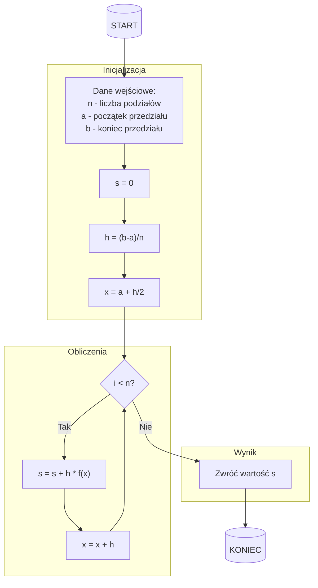
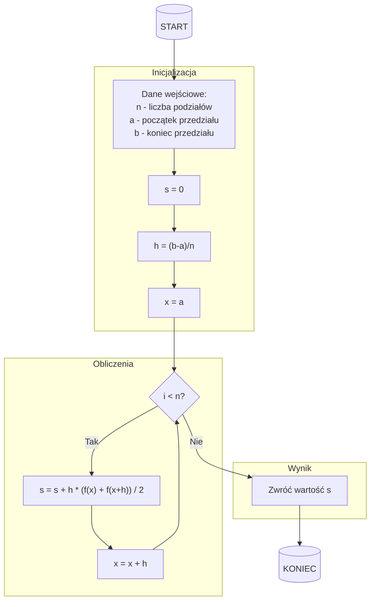
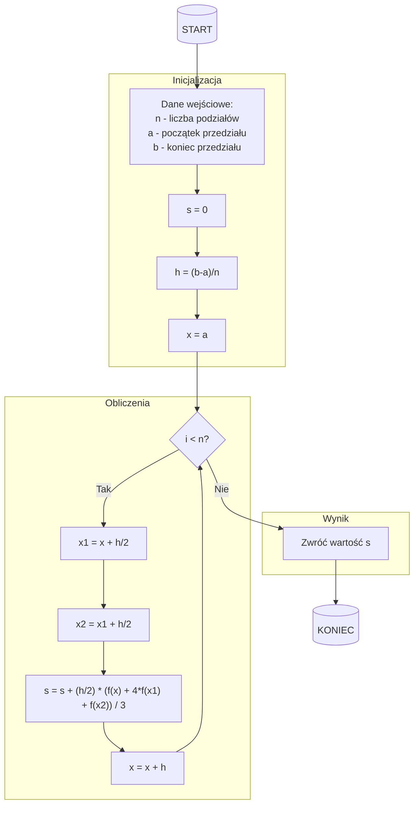

# Diagramy
`h` - reprezentuje szerokość pojedynczego podprzedziału
## Metoda Prostokątów

```mermaid
graph TD
    Start[("START")]
    End[("KONIEC")]

    subgraph Inicjalizacja
        Input["Dane wejściowe:
        n - liczba podziałów
        a - początek przedziału
        b - koniec przedziału"]
        InitS["s = 0"]
        CalcH["h = (b-a)/n"]
        InitX["x = a + h/2"]
    end

    subgraph Obliczenia
        CheckI{"i < n?"}
        CalcArea["s = s + h * f(x)"]
        UpdateX["x = x + h"]
    end

    subgraph Wynik
        ReturnS["Zwróć wartość s"]
    end

    Start --> Input
    Input --> InitS
    InitS --> CalcH
    CalcH --> InitX
    InitX --> CheckI
    CheckI -->|Tak| CalcArea
    CalcArea --> UpdateX
    UpdateX --> CheckI
    CheckI -->|Nie| ReturnS
    ReturnS --> End
```

## Metoda Trapezów

```mermaid
graph TD
    Start[("START")]
    End[("KONIEC")]

    subgraph Inicjalizacja
        Input["Dane wejściowe:
        n - liczba podziałów
        a - początek przedziału
        b - koniec przedziału"]
        InitS["s = 0"]
        CalcH["h = (b-a)/n"]
        InitX["x = a"]
    end

    subgraph Obliczenia
        CheckI{"i < n?"}
        CalcArea["s = s + h * (f(x) + f(x+h)) / 2"]
        UpdateX["x = x + h"]
    end

    subgraph Wynik
        ReturnS["Zwróć wartość s"]
    end

    Start --> Input
    Input --> InitS
    InitS --> CalcH
    CalcH --> InitX
    InitX --> CheckI
    CheckI -->|Tak| CalcArea
    CalcArea --> UpdateX
    UpdateX --> CheckI
    CheckI -->|Nie| ReturnS
    ReturnS --> End
```

## Metoda Simpsona

```mermaid
graph TD
    Start[("START")]
    End[("KONIEC")]

    subgraph Inicjalizacja
        Input["Dane wejściowe:
        n - liczba podziałów
        a - początek przedziału
        b - koniec przedziału"]
        InitS["s = 0"]
        CalcH["h = (b-a)/n"]
        InitX["x = a"]
    end

    subgraph Obliczenia
        CheckI{"i < n?"}
        CalcX1["x1 = x + h/2"]
        CalcX2["x2 = x1 + h/2"]
        CalcArea["s = s + (h/2) * (f(x) + 4*f(x1) + f(x2)) / 3"]
        UpdateX["x = x + h"]
    end

    subgraph Wynik
        ReturnS["Zwróć wartość s"]
    end

    Start --> Input
    Input --> InitS
    InitS --> CalcH
    CalcH --> InitX
    InitX --> CheckI
    CheckI -->|Tak| CalcX1
    CalcX1 --> CalcX2
    CalcX2 --> CalcArea
    CalcArea --> UpdateX
    UpdateX --> CheckI
    CheckI -->|Nie| ReturnS
    ReturnS --> End
```
