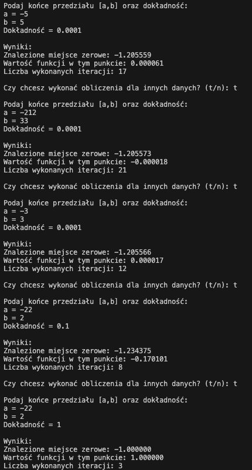

# Analiza wyników testów metody bisekcji

## 1. Zestawienie przeprowadzonych testów

### Test 1
- Przedział: [-5, 5]
- Dokładność: 0.0001
- Wyniki:
  - Miejsce zerowe: -1.205559
  - Wartość funkcji: 0.000061
  - Liczba iteracji: 17

### Test 2
- Przedział: [-212, 33]
- Dokładność: 0.0001
- Wyniki:
  - Miejsce zerowe: -1.205573
  - Wartość funkcji: -0.000018
  - Liczba iteracji: 21

### Test 3
- Przedział: [-3, 3]
- Dokładność: 0.0001
- Wyniki:
  - Miejsce zerowe: -1.205566
  - Wartość funkcji: -0.000017
  - Liczba iteracji: 12

### Test 4
- Przedział: [-22, 2]
- Dokładność: 0.1
- Wyniki:
  - Miejsce zerowe: -1.234375
  - Wartość funkcji: -0.170101
  - Liczba iteracji: 8

### Test 5
- Przedział: [-22, 2]
- Dokładność: 1
- Wyniki:
  - Miejsce zerowe: -1.000000
  - Wartość funkcji: 1.000000
  - Liczba iteracji: 3

## 2. Analiza wyników

### Wpływ wielkości przedziału
1. Dla stałej dokładności 0.0001:
   - Przedział [-3, 3]: 12 iteracji
   - Przedział [-5, 5]: 17 iteracji
   - Przedział [-212, 33]: 21 iteracji
   
Obserwacja: Wraz ze wzrostem szerokości przedziału wzrasta liczba iteracji, ale wzrost ten jest logarytmiczny.

### Wpływ dokładności
Dla przedziału [-22, 2]:
- Dokładność 1: 3 iteracje
- Dokładność 0.1: 8 iteracji
- Dokładność 0.0001: > 8 iteracji (widoczne w innych testach)

Obserwacja: Zwiększenie dokładności (zmniejszenie wartości) znacząco wpływa na liczbę wymaganych iteracji.

### Dokładność wyników
1. Dla wysokiej dokładności (0.0001):
   - Wszystkie znalezione miejsca zerowe są zbieżne do wartości około -1.20557
   - Wartość funkcji w znalezionych punktach jest bliska zeru (rząd 10⁻⁵)

2. Dla niższej dokładności:
   - Dokładność 0.1: miejsce zerowe = -1.234375
   - Dokładność 1: miejsce zerowe = -1.000000
   - Widoczne znaczące pogorszenie jakości wyniku

## 3. Wnioski końcowe

1. **Efektywność algorytmu**:
   - Nawet dla bardzo dużych przedziałów ([-212, 33]) algorytm znajduje rozwiązanie w rozsądnej liczbie iteracji (21)
   - Liczba iteracji rośnie logarytmicznie wraz z rozmiarem przedziału

2. **Wpływ dokładności**:
   - Ma kluczowe znaczenie dla jakości wyniku
   - Znacząco wpływa na liczbę wymaganych iteracji
   - Dla dokładności 0.0001 uzyskujemy wiarygodne wyniki z błędem rzędu 10⁻⁵

3. **Stabilność**:
   - Algorytm wykazuje stabilność - dla różnych przedziałów początkowych znajduje to samo miejsce zerowe
   - Wartość funkcji w znalezionych punktach jest odpowiednio mała, co potwierdza poprawność wyników

4. **Rekomendacje**:
   - Dla praktycznych zastosowań dokładność 0.0001 wydaje się optymalnym wyborem
   - Warto zawężać przedział poszukiwań jeśli to możliwe, ale nie jest to krytyczne dla wydajności
   - Należy unikać zbyt niskiej dokładności (> 0.1), gdyż prowadzi to do znaczących błędów w wyniku