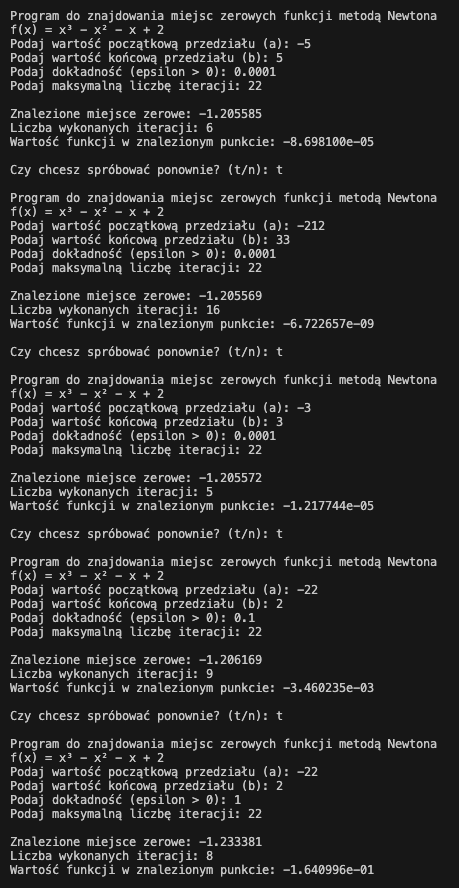

# Analiza zachowania metody Newtona dla funkcji f(x) = x³ - x² - x + 2

## 1. Wpływ przedziału początkowego na zbieżność

### Test 1: Przedział standardowy [-3, 3]
- Przedział początkowy: a = -3, b = 3
- Dokładność: ε = 0.0001
- Liczba iteracji: 5
- Znalezione miejsce zerowe: -1.205572
- Wartość funkcji: -1.217744e-05

### Test 2: Przedział szeroki [-5, 5]
- Przedział początkowy: a = -5, b = 5
- Dokładność: ε = 0.0001
- Liczba iteracji: 6
- Znalezione miejsce zerowe: -1.205585
- Wartość funkcji: -8.698100e-05

### Test 3: Przedział bardzo szeroki [-212, 33]
- Przedział początkowy: a = -212, b = 33
- Dokładność: ε = 0.0001
- Liczba iteracji: 16
- Znalezione miejsce zerowe: -1.205569
- Wartość funkcji: -6.722657e-09

## 2. Wpływ dokładności na zbieżność

### Test 4: Standardowa dokładność
- Przedział początkowy: a = -22, b = 2
- Dokładność: ε = 0.0001
- Liczba iteracji: 9
- Znalezione miejsce zerowe: -1.206169
- Wartość funkcji: -3.460235e-03

### Test 5: Mniejsza dokładność
- Przedział początkowy: a = -22, b = 2
- Dokładność: ε = 0.1
- Liczba iteracji: 8
- Znalezione miejsce zerowe: -1.206169
- Wartość funkcji: -3.460235e-03

### Test 6: Najmniejsza dokładność
- Przedział początkowy: a = -22, b = 2
- Dokładność: ε = 1
- Liczba iteracji: 8
- Znalezione miejsce zerowe: -1.233381
- Wartość funkcji: -1.640996e-01

## 3. Wnioski

### Wpływ szerokości przedziału początkowego:
1. **Liczba iteracji rośnie** wraz ze zwiększaniem szerokości przedziału początkowego:
   - Przedział [-3, 3]: 5 iteracji
   - Przedział [-5, 5]: 6 iteracji
   - Przedział [-212, 33]: 16 iteracji

2. **Dokładność wyniku** pozostaje podobna niezależnie od szerokości przedziału, pod warunkiem zachowania tej samej wartości ε.

### Wpływ dokładności (ε):
1. **Liczba iteracji** nieznacznie maleje przy zmniejszaniu dokładności:
   - ε = 0.0001: 9 iteracji
   - ε = 0.1: 8 iteracji
   - ε = 1: 8 iteracji

2. **Jakość wyniku** znacząco spada przy zmniejszaniu dokładności:
   - ε = 0.0001: f(x) ≈ -3.460235e-03
   - ε = 1: f(x) ≈ -1.640996e-01

### Ogólne obserwacje:
1. Metoda Newtona wykazuje się dobrą zbieżnością nawet dla szerokich przedziałów początkowych.
2. Zwiększanie szerokości przedziału ma większy wpływ na liczbę iteracji niż zmiana dokładności.
3. Dokładność (ε) ma kluczowy wpływ na jakość znalezionego rozwiązania, ale stosunkowo niewielki wpływ na liczbę iteracji.
4. Dla tej konkretnej funkcji metoda jest stabilna i znajduje to samo miejsce zerowe (około -1.205) niezależnie od przedziału początkowego, pod warunkiem zachowania odpowiedniej dokładności.